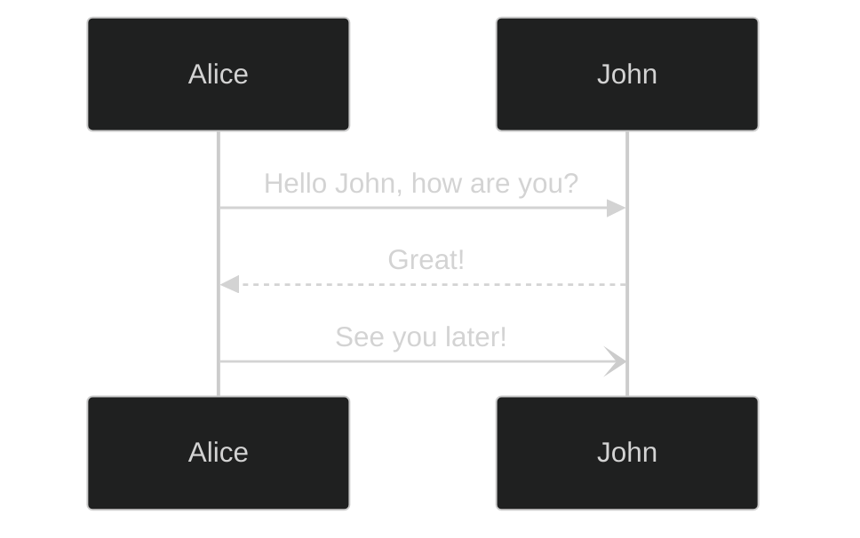

# Use Cases

[TOC]

# Heading 1

Here - I can just write stuf

```mermaid
sequenceDiagram
%%{init: {'theme':'dark'}}%%
    Participant Alice
    Alice->>John: Hello John, how are you?
    John-->>Alice: Great!
    Alice-)John: See you later!
```
